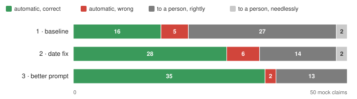
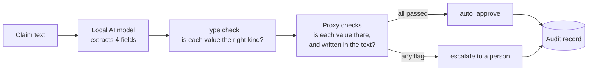

# local-claim-intake

A small service that reads a free-text car insurance claim, pulls out four facts — **policy number, incident date,
amount claimed, licence plate** — and checks each one against the text. If every check passes, the claim goes through
automatically; if anything is doubtful, it goes to a person. The AI model runs locally, so claim data never leaves the
machine, and every decision is saved as an audit record.

## Results at a glance

Measured on 50 mock claims — 10 clean, 40 built around a known trap (two dates, a correction, a forwarded thread, …):

- **37 went through automatically; 2 of those were wrong.**
- **13 went to a person** — in each, a field was wrong or missing.
- Two fixes got there from a first run with 16 correct and 5 wrong automatic decisions (details in
  [How it's measured](#how-its-measured)).



Full report: [`eval/results/2026-10-01_report.pdf`](eval/results/2026-10-01_report.pdf)
(also as [HTML](eval/results/2026-10-01_report.html)).

## How it works



1. The AI model reads the claim and answers with the four fields — or "not there" when the text doesn't state one.
2. **Proxy checks** each ask one question about one field: is the value present? Is it actually written in the claim
   text (dates read day-first, amounts in German number format, identifiers with or without spaces)?
3. **The rule:** any flag sends the claim to a person. The checks are plain code — the same answer and text always
   give the same decision.
4. The decision is saved as an **audit record** before the response leaves.
5. **If the AI model gives no usable answer** — the model server can't be reached, takes longer than 60 seconds,
   returns an error, or replies with something unusable — the claim goes to a person, and the audit record says why.

## Where AI, where not

Plain pattern search can find every date and every amount in a claim. What it can't do is *choose*: which of two
dates is the incident date, which of two amounts is claimed. That choice is the AI model's only job; finding,
reading and verifying the values is ordinary code.

In the latest run, 7 claims contained more than one date and the AI model chose correctly in all 7; 9 contained more
than one amount and it chose correctly in 7 (the other 2 went to a person).

## How it's measured

- **50 mock claims** (`eval/mock_claims.yaml`), each with an answer key: 10 clean, plus 8 kinds of messiness with 5
  claims each — two dates, two amounts, two plates, a correction in the text, a missing field, an unusual date form,
  a forwarded email thread, informal messy text.
- Each claim goes through the real endpoint; each decision gets one of four grades: **automatic and correct ·
  automatic but wrong · rightly sent to a person · needlessly sent to a person.**
- Three runs, one change each (`eval/runs.yaml`):

| Run | What changed | Automatic, correct | Automatic, wrong |
|---|---|---|---|
| 1 · baseline | the service as first built | 16 | 5 |
| 2 · date fix | the AI model copies each date exactly as the claim writes it (e.g. 28.04.2026); our code converts it | 28 | 6 |
| 3 · better prompt | the prompt defines the four fields and their formats | 35 | 2 |

- **What the date fix changed:** the first version asked the AI model to return each date in year-month-day form. The
  model server enforced that form while the AI model was still copying the Austrian day-first digits, so 15 of the 50
  dates came out garbled ("28.04.2026" became "2804-04-20"). The proxy checks flagged all 15, so those claims went to
  a person instead of through automatically. Since the fix, the AI model copies the date exactly as written and our
  code converts it.
- **The 2 remaining wrong automatic decisions** share one cause: the AI model picked a *wrong value that is also in
  the text* (an email's sent date instead of "yesterday"; an old plate from a quoted message). A check that asks "is
  this value in the text?" can't catch that — it's this approach's known blind spot.

**Limits.** 50 mock claims, written for this demo. For each kind of messiness, the results show whether the approach
handles it; kinds not in the set remain untested. The set is too small and too artificial to promise an error rate
on real claims — that would need real (anonymized) claims at a much larger scale.

Reproduce: `python -m eval.run_eval <run-name>`, then
`python -m eval.report <date> <run-names…>` (needs the AI model running).

## What the tests protect

`pytest` runs in under a second and needs no AI model (a stand-in replaces it):

- **No wrong value goes through because of a broken rule** — the rule is tested on 24 hand-written AI model answers,
  each changing one thing in a correct answer.
- **Austrian dates, amounts and identifiers are read correctly** — day-first dates, "1.450,50 €", plates with or
  without spaces.
- **Bugs found while measuring can't come back** — the date format rule that garbled 15 dates, and a grading mistake
  for claims with a missing field.
- **Every decision is recorded** — the endpoint with a stand-in AI model: decision, audit record, `/stats`.
- **A failing AI model never loses a claim** — an unreachable model server or an unusable reply still ends in a
  recorded decision (to a person), with the reason.

**Known limits are tests too.** 8 of the 24 cases are marked as expected failures — what checking values against
the claim text can't do, e.g. a wrong date that also appears in the text.

**The tests are tested.** `python scripts/break_check.py` breaks the code on purpose in three places — the rule,
reading dates, matching identifiers — and shows which tests notice. Each break is caught (13, 4 and 3 failing tests).

## The stated assumption

This demo rests on one stated assumption: claims arrive as free text. If HDI's intake is already structured, the
right answer may be less AI, not more.

## Run it

Both ways need [Ollama](https://ollama.com) with the AI model: `ollama pull qwen3.5:4b` (about 3.4 GB).

**With Docker** — the service and a PostgreSQL database, one command:

```bash
docker compose up --build
```

The service is then at `http://localhost:8000` (set `SERVICE_PORT=8010` to use another port). On Linux, Ollama must
accept connections from Docker: start it with `OLLAMA_HOST=0.0.0.0`.

**Without Docker** — Python 3.13, audit records in a local SQLite file:

```bash
python3 -m venv venv && source venv/bin/activate
pip install -r requirements.txt
uvicorn app.edges.api:app
```

**Try it:**

```bash
curl -s localhost:8000/claims -H 'Content-Type: application/json' \
  -d '{"claim_text": "Am 12.03.2026 bin ich gegen eine Säule gefahren. Kennzeichen W-48213K, Polizze VK-310582-A, Reparatur 1.450,50 €."}'
curl -s localhost:8000/stats
```

Settings (AI model, model server, database) are environment variables — see `.env.example`. Any model server that
speaks the OpenAI-compatible protocol works.

## Audit records

Every decision is one row in `audit_records`: when the claim arrived, the claim text, the AI model's answer, every
proxy check result (so each record explains its own decision), the outcome, and which exact version of the AI model
and of its instructions (prompt and answer format) made the decision. If the record can't be saved, the request fails: no decision leaves without its record.

`GET /stats` returns the straight-through rate — the share of decisions made with no person involved.

Why was a claim sent to a person? One query answers it (PostgreSQL):

```sql
SELECT r.id, check_result->>'field' AS field, check_result->>'kind' AS check, check_result->>'detail' AS detail
FROM audit_records r, json_array_elements(r.proxy_check_results) AS check_result
WHERE r.id = 2 AND (check_result->>'passed')::boolean = false;
```

## Design choices and limits

- **Local AI model.** Claim texts contain personal data; a local model keeps them on the machine. A cloud model
  (e.g. via Microsoft Foundry) could be connected through the same settings — not tested here.
- **The AI model runs outside Docker.** On a Mac, containers run in a Linux virtual machine without access to the
  graphics chip, so a model inside would run on the processor alone. On a Linux machine with an NVIDIA GPU, it could
  run in its own container, e.g. with vLLM.
- **SQLite locally, PostgreSQL in Docker.** The same code runs on both; one setting switches them (SQLAlchemy).
- **The service runs as an ordinary user, not root,** inside its container.
- **Not built:** consistency checks (e.g. an incident date in the future) and a policy database to check numbers
  against.

## How this was made

- Built with an AI coding assistant (Claude). The design decisions — what to check, how to measure, what to leave
  out — are the author's own; each step was reviewed before it was committed.
- **Mock claims:** drafted by Claude from a written spec (`eval/drafting-spec.md`); the author checked every claim's
  answer key. The local AI model never wrote claims it is graded on.
- **Run 3's prompt** was written after seeing the baseline's misses and measured on the same 50 claims. It holds only
  general rules (what each field means and looks like) and names no specific trap.
- **The policy-number format** (`VK-123456-A`) is made up.
- All names, addresses and numbers are fictional.

## Where to look

| Folder | What's there |
|---|---|
| `app/core/` | pure logic: the data shapes, the proxy checks and the rule, text matching — no network, no AI model |
| `app/edges/` | everything that talks to the outside: the API, the AI model, the database, settings |
| `eval/` | mock claims, the drafting spec, the runner, the report, and every saved run |
| `tests/`, `scripts/break_check.py` | the tests, and the check that they catch deliberate breaks |
| `Dockerfile`, `docker-compose.yml` | the service image and the two-container setup |
